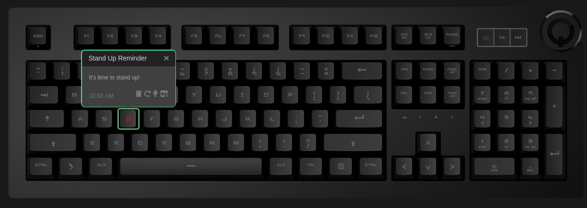

# Q Applet: Stand Up Reminder

Do you find yourself sitting at your desk for long periods at a time?
This applet will remind you to stand up every hour by blinking a key of your choice.

[GitHub repository](assets/stand-up-reminder.png)

## Example

The "D" key will blink red every hour and :10 minutes to remind you to stand up.

## Changelog

[CHANGELOG.MD](CHANGELOG.md)

## Installation

Requires a Das Keyboard Q Series: www.daskeyboard.com/5q

Installation, configuration and uninstallation of applets is done within
the Q Desktop application (https://www.daskeyboard.io/get-started/software/)

## Docs & Contribute

## Copyright / License

Copyright 2014 - 2018 Das Keyboard / Metadot Corp.

Licensed under the GNU General Public License Version 2.0 (or later);
you may not use this work except in compliance with the License.
You may obtain a copy of the License in the LICENSE file, or at:

   http://www.gnu.org/licenses/old-licenses/gpl-2.0.txt

Unless required by applicable law or agreed to in writing, software
distributed under the License is distributed on an "AS IS" BASIS,
WITHOUT WARRANTIES OR CONDITIONS OF ANY KIND, either express or implied.
See the License for the specific language governing permissions and
limitations under the License.
